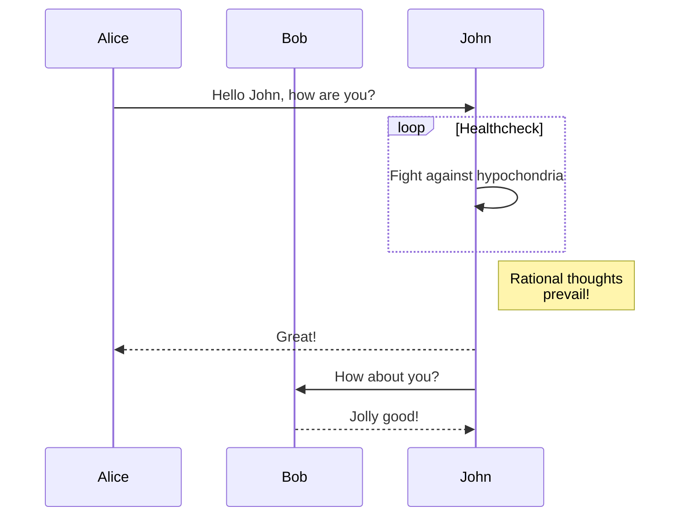

+++
date = '2026-03-18T14:04:31-08:00'
draft = false
title = 'Hello World'
+++

I decided to re-create my blog using Hugo. I was using Quartz to host an Obsidian vault as my block, since I became intrigued with the idea of a digital garden. What attracted me was the idea of atomic notes from the Zettelkasten Method, but I think I missed the point. My initial thought process was that starting is the hardest, and with atomic notes in a digital garden, the idea is that you would just start and fill in the details later, almost like sketching.

In reality, it resulted in next to nothing being added, and even fewer notes being completed. Nothing would ever be done, and in the case of taking notes on development, the existing notes would contain a mixture of relevant, up-to-date information and outdated information. This meant that whenever I modified a note, and thus the last modified time-stamp was updated, I would need to ensure that all the note's contents were up to date. This mindset promoted really small atomic notes, which was great in theory since each note would be on a single topic, but the new problem was how to link all the small notes together in a meaningful way.

I am certain that all of these things could be solved through crafting a plan and being disciplined in how the plan is executed; however, in many cases, I just want to write until a given page is “good enough” and post it. Then, once posted, it can serve as a snapshot of what it is at the time it was written. This traditional blogging format feels simpler to me. So I am starting this over.

## The basic design plan

1. Have three sections
    1. A Home page: basic landing page
    1. A Blog page: all my chronological blog posts
    1. A resources page: a collection of public bookmarks

This leaves the possibility of adding a fourth "notes" section in the future. Next there are the functional requirements.

## Functional Requirements

1. Code blocks have syntax highlighting
1. Can render mermaid diagrams
1. Is styled using a single basic CSS file
1. Has an [RSS feed](/index.xml)
1. All content is written in markdown
1. Supports images

Luckily for me, [Hugo](https://gohugo.io/) supports all of the above.

## Syntax Highlighting

Here are a few examples in a few languages.

**C++:**

```cpp
int main() {
    std::cout << "Hello, World!" << std::endl;
}
```

**JavaScript:**

```js
console.log("Hello, World!");
```

**Lua:**

```lua
print("Hello, World!")
```

## Mermaid diagrams

Mermaid diagrams require a bit of additional setup outlined [here](https://gohugo.io/content-management/diagrams/#mermaid-diagrams).



## GoAT diagrams

This is something new I learned about in the [hugo docs](https://gohugo.io/content-management/diagrams/#goat-diagrams-ascii).

```goat
      .               .                .               .--- 1          .-- 1     / 1
     / \              |                |           .---+            .-+         +
    /   \         .---+---.         .--+--.        |   '--- 2      |   '-- 2   / \ 2
   +     +        |       |        |       |    ---+            ---+          +
  / \   / \     .-+-.   .-+-.     .+.     .+.      |   .--- 3      |   .-- 3   \ / 3
 /   \ /   \    |   |   |   |    |   |   |   |     '---+            '-+         +
 1   2 3   4    1   2   3   4    1   2   3   4         '--- 4          '-- 4     \ 4
```

**Original:**

```txt
      .               .                .               .--- 1          .-- 1     / 1
     / \              |                |           .---+            .-+         +
    /   \         .---+---.         .--+--.        |   '--- 2      |   '-- 2   / \ 2
   +     +        |       |        |       |    ---+            ---+          +
  / \   / \     .-+-.   .-+-.     .+.     .+.      |   .--- 3      |   .-- 3   \ / 3
 /   \ /   \    |   |   |   |    |   |   |   |     '---+            '-+         +
 1   2 3   4    1   2   3   4    1   2   3   4         '--- 4          '-- 4     \ 4
```

These diagrams are really cool, with lots of different designs:

```goat
+-------------------+                           ^                      .---.
|    A Box          |__.--.__    __.-->         |      .-.             |   |
|                   |        '--'               v     | * |<---        |   |
+-------------------+                                  '-'             |   |
                       Round                                       *---(-. |
  .-----------------.  .-------.    .----------.         .-------.     | | |
 |   Mixed Rounded  | |         |  / Diagonals  \        |   |   |     | | |
 | & Square Corners |  '--. .--'  /              \       |---+---|     '-)-'       .--------.
 '--+------------+-'  .--. |     '-------+--------'      |   |   |       |        / Search /
    |            |   |    | '---.        |               '-------'       |       '-+------'
    |<---------->|   |    |      |       v                Interior                 |     ^
    '           <---'      '----'   .-----------.              ---.     .---       v     |
 .------------------.  Diag line    | .-------. +---.              \   /           .     |
 |   if (a > b)     +---.      .--->| |       | |    | Curved line  \ /           / \    |
 |   obj->fcn()     |    \    /     | '-------' |<--'                +           /   \   |
 '------------------'     '--'      '--+--------'      .--. .--.     |  .-.     +Done?+-'
    .---+-----.                        |   ^           |\ | | /|  .--+ |   |     \   /
    |   |     | Join        \|/        |   | Curved    | \| |/ | |    \    |      \ /
    |   |     +---->  o    --o--        '-'  Vertical  '--' '--'  '--  '--'        +  .---.
 <--+---+-----'       |     /|\                                                    |  | 3 |
                      v                             not:line    'quotes'        .-'   '---'
  .-.             .---+--------.            /            A || B   *bold*       |        ^
 |   |           |   Not a dot  |      <---+---<--    A dash--is not a line    v        |
  '-'             '---------+--'          /           Nor/is this.            ---
```

**Original:**

```txt
+-------------------+                           ^                      .---.
|    A Box          |__.--.__    __.-->         |      .-.             |   |
|                   |        '--'               v     | * |<---        |   |
+-------------------+                                  '-'             |   |
                       Round                                       *---(-. |
  .-----------------.  .-------.    .----------.         .-------.     | | |
 |   Mixed Rounded  | |         |  / Diagonals  \        |   |   |     | | |
 | & Square Corners |  '--. .--'  /              \       |---+---|     '-)-'       .--------.
 '--+------------+-'  .--. |     '-------+--------'      |   |   |       |        / Search /
    |            |   |    | '---.        |               '-------'       |       '-+------'
    |<---------->|   |    |      |       v                Interior                 |     ^
    '           <---'      '----'   .-----------.              ---.     .---       v     |
 .------------------.  Diag line    | .-------. +---.              \   /           .     |
 |   if (a > b)     +---.      .--->| |       | |    | Curved line  \ /           / \    |
 |   obj->fcn()     |    \    /     | '-------' |<--'                +           /   \   |
 '------------------'     '--'      '--+--------'      .--. .--.     |  .-.     +Done?+-'
    .---+-----.                        |   ^           |\ | | /|  .--+ |   |     \   /
    |   |     | Join        \|/        |   | Curved    | \| |/ | |    \    |      \ /
    |   |     +---->  o    --o--        '-'  Vertical  '--' '--'  '--  '--'        +  .---.
 <--+---+-----'       |     /|\                                                    |  | 3 |
                      v                             not:line    'quotes'        .-'   '---'
  .-.             .---+--------.            /            A || B   *bold*       |        ^
 |   |           |   Not a dot  |      <---+---<--    A dash--is not a line    v        |
  '-'             '---------+--'          /           Nor/is this.            ---
```

## Images

Here is a screenshot of the code in this page:


## Footnotes

Here is some text with a footnote[^1].

[^1]: This is the actual footnote
